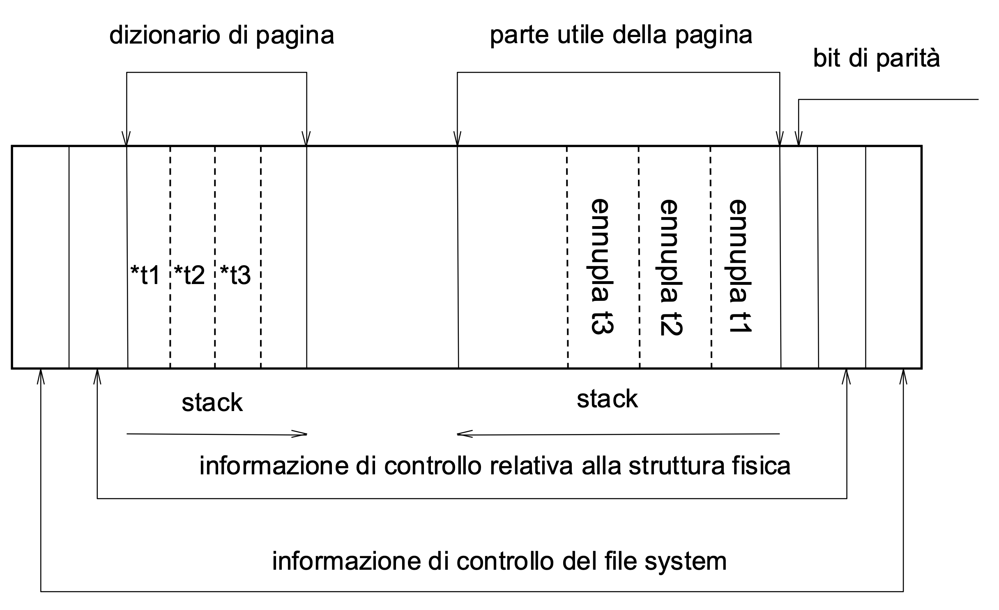
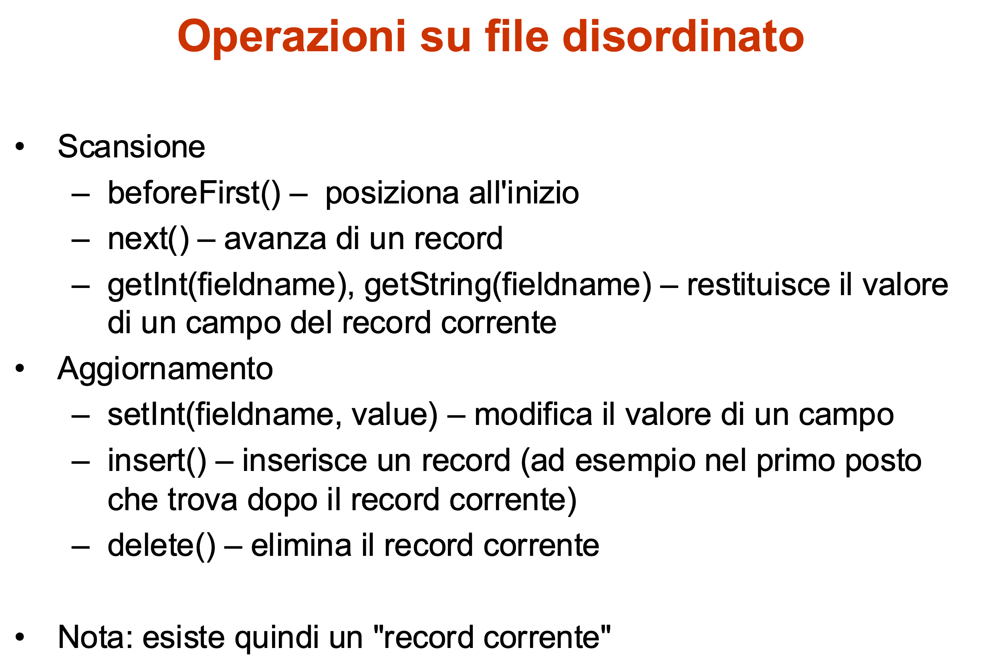
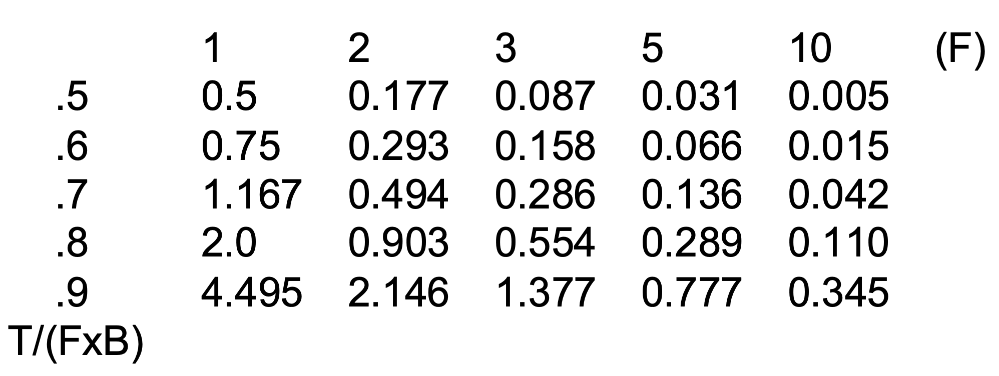
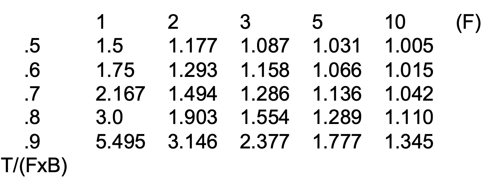
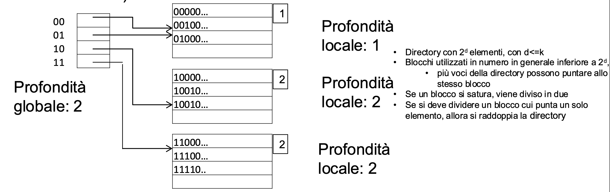
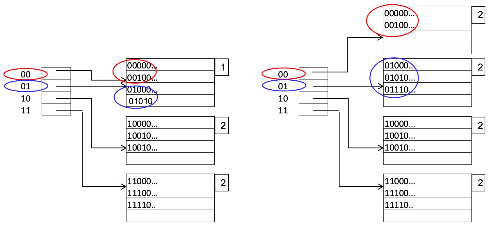
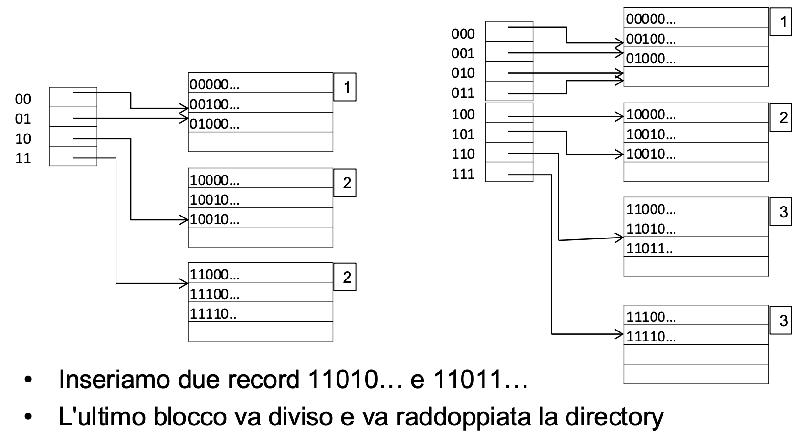

# Gestione dei buffer
**Buffer**:

* area di memoria centrale, gestita dal DBMS (preallocata) e condivisa fra le transazioni
* organizzato in **pagine** di dimensioni pari o multiple di quelle dei blocchi di memoria secondaria ($1$KB-$100$KB)
* è importantissimo per via della grande differenza di tempo di accesso fra memoria centrale e memoria secondaria

Il suo scopo è _ridurre il numero di accessi alla memoria secondaria_. In caso di lettura, se la pagina è già nel buffer, non è necessario leggere da memoria secondaria. In caso di scrittura, il gestore del buffer può decidere di differire la scrittura fisica (ammesso che ciò sia compatibile con la gestione dell’affidabilità - vedremo più avanti). Sfrutta la **località dei dati**: è alta la probabilità di riutilizzare dati utilizzati di recente.

# Dati gestiti dal buffer manager
Contiene: 

- Il buffer
- Un direttorio (una tavola) che per ogni pagina mantiene un insieme di informazioni utili, ad esempio:
	- un identificatore fisico del blocco (ad esempio il nome del file e il numero del blocco; oppure l'indirizzo fisico del blocco)
	- due variabili di stato:
		- un contatore che indica quanti programmi utilizzano la pagina
		- un booleano che indica se la pagina è “sporca”, cioè se è stata modificata

# Funzioni del buffer manager
Intuitivamente:

- riceve richieste di lettura e scrittura (di pagine/blocchi)
- le esegue accedendo alla memoria secondaria solo quando indispensabile e utilizzando invece il buffer quando possibile
-  esegue le primitive
	-  **_fix (pin), unfix (unpin), setDirty, force (flush)_**
	-  in simpleDB: **_pin, unpin, setModified, flush_**

## Interfaccia offerta dal buffer manager
- _fix_ o _pin_: richiesta di un blocco da parte di un programma
	- restituisce il numero della pagina in cui è presente il blocco
	- esegue una lettura fisica se il blocco non è nel buffer
	- incrementa il contatore associato al blocco (pagina) stesso
- _setDirty_: comunica al buffer manager che la pagina è stata modificata e non ancora salvata in memoria secondaria (a seconda delle implementazioni può non essere necessaria; o essere gestita direttamente dalle operazioni di modifica)
	- tiene traccia dell'informazione
- _unfix_ o _unpin_: indica che il programma ha concluso l'utilizzo della pagina
	- decrementa il contatore associato alla pagina
- _force_ o _flush_: trasferisce in modo sincrono una pagina in memoria secondaria (serve al gestore dell'affidabilità)
	- scrive su disco

Il buffer manager esegue scritture in due contesti diversi: in modo **sincrono** quando è richiesto esplicitamente con
una force/flush (vedremo in seguito, cfr. gestione dell'affidabilità, in modo **asincrono** rispetto alle richieste quando lo ritiene
opportuno (o necessario) per liberare una pagina; ma può decidere di anticipare o posticipare scritture per coordinarle e/o sfruttare la disponibilità dei dispositivi.

# Strategia di rimpiazzo (Buffer replacement strategy)
Quale che sia la politica (steal o no-steal), si pone l'esigenza di scegliere la pagina libera da associare al blocco (l'ideale sarebbe mantenere nel buffer le pagine che, pur libere, potrebbero essere riutilizzate)

Strategie (supponiamo politica no-steal, che è l'unica che ci interessa):

- naif (utilizza per il rimpiazzo la prima pagina libera)
- FIFO (utilizza per il rimpiazzo la pagina libera che è stata caricata da più tempo)
- LRU (utilizza per il rimpiazzo la pagina libera che è stata usata meno di recente)
- clock (fa una scansione, come nel caso naif, ma non dall'inizio, bensì dalla pagina successiva a quella del rimpiazzo precedente)

# Blocchi e record

Un file è **logicamente** composto di record (ennuple), **fisicamente** organizzato in blocchi. I blocchi (componenti "fisici" di un file) e i record (componenti "logici") hanno dimensioni in generale diverse:

- la dimensione del blocco dipende dal file system;
- la dimensione del record (semplificando un po') dipende dalle esigenze dell'applicazione (ad esempio, gli attributi della relazione), e può anche variare nell'ambito di un file.

I campi (e quindi i record) possono essere a **lunghezza fissa**(semplifica le operazioni, in particolare le modifiche, ma può causare spreco di spazio) o a **lunghezza variabile**.

I blocchi (e i file) possono essere **omogenei** (tutti i record dalla stessa relazione) o **eterogenei** (record provenienti da relazioni diverse).

 I record possono essere ognuno interamente in un blocco (il che richiede che i record siano più piccoli dei blocchi): **unspanned**, oppure anche divisi fra più blocchi (necessario se sono grandi, utilizzato anche per risparmiare un po' di spazio): **spanned**.

 **Fattore di blocco**: numero di record in un blocco.
Nel caso, frequente, di blocchi omogenei e record a lunghezza fissa, più piccola della dimensione del blocco:

- $L_R$: dimensione di un record
- $L_B$: dimensione di un blocco
- fattore di blocco: $\lfloor \frac {L_B} {L_R}\rfloor$

# **Organizzazione delle ennuple nelle pagine**

{latex-placement="h"}

## Strutture fisiche
**Due** aspetti: 

1. la modalità di organizzazione dei record in un file (o delle ennuple di una tabella):  strutture **primarie**;
2. ulteriori elementi che permettono un accesso efficiente ai record di un file: strutture **secondarie**.

Tipi di strutture fisiche:

- Sequenziali: primarie
- Calcolate ("Hash"): primarie (e talvolta secondarie)
- Ad albero (di solito, indici): secondarie o primarie

### Strutture sequenziali
Esiste un ordinamento fra le ennuple, che può essere rilevante ai fini della gestione

- **seriale** (o disordinata): ordinamento fisico ma non logico
- ~~array: posizioni individuate attraverso valori (numerici progessivi)~~
- **ordinata**: ordinamento fisico coerente con quello di un campo

{latex-placement="h"}

#### Strutture seriali o disordinate

Chiamata anche: file seriale, "entry sequenced", file heap ("mucchio"). È molto diffusa nelle BD relazionali, associata a indici secondari.
Gli **inserimenti** avvengono di solito in **coda** (con riorganizzazioni periodiche) oppure al posto di record cancellati.
Le **eliminazioni** avvengono «lasciando i **vuoti**» (salvo riorganizzazioni periodiche). La **gestione** è molto **semplice**, ma spesso **inefficiente**.

{latex-placement="h"}

Sia per ricerca, sia per inserimento: costo di solito lineare (nel numero di blocchi del file)

#### Strutture ordinate

Ogni record (ennupla) ha una posizione basata sul valore di un campo (detto chiave o, meglio, pseudochiave). 
Gli aggiornamenti dovrebbero essere coerenti. Possono richiedere modifiche significative:  inserimenti, campi a lunghezza variabile con valori più lunghi dei precedenti.

Soluzioni (anche combinate):

- riorganizzazione immediata
- spazio inizialmente ridondante
- inserimenti in coda o in blocchi di overflow
- riorganizzazioni periodiche

Permettono ricerche binarie ma solo in alcuni casi. Come troviamo la "metà" del file? E poi la metà della metà? Nelle basi di dati relazionali si utilizzano quasi solo in combinazione con indici (file ISAM o file ordinati con indice primario). Comunque, sono utili per fornire risultati ordinati e in preparazione per altre operazioni

### File hash

Accesso diretto o associativo (cioè accesso sulla base del valore di un campo) molto efficiente.

In SimpleDB, invece del metodo beforeFirst() che abbiamo nel file disordinato (o ordinato), abbiamo un metodo: beforeFirst(searchKey)
La tecnica si basa su quella utilizzata per le tavole hash in memoria centrale.

#### Tavola hash
**Obiettivo: accesso diretto ad un insieme di record** sulla base del valore di un campo (detto chiave, che per semplicità supponiamo identificante, ma non è necessario). Se i possibili valori della chiave sono in numero paragonabile al numero di record (e corrispondono ad un "tipo indice") allora usiamo un array; ad esempio: università con 1000 studenti e
numeri di matricola compresi fra 1 e 1000 o poco più e file con
tutti gli studenti.
Se i possibili valori della chiave sono molti di più di quelli effettivamente utilizzati, non possiamo usare l'array (spreco); ad esempio: 40 studenti e matricola di 6 cifre (un milione di
possibili chiavi).

Volendo continuare ad usare qualcosa di simile ad un array, ma senza sprecare spazio, possiamo pensare di trasformare i valori della chiave in possibili indici di un array

#### Funzione hash:
Associa ad ogni valore della chiave un "indirizzo", in uno spazio di dimensione paragonabile (leggermente superiore) a quello strettamente necessario. Poiché il numero di possibili chiavi è molto maggiore del numero di possibili indirizzi ("lo spazio delle chiavi è più grande dello spazio degli indirizzi"), la funzione non può essere iniettiva e quindi esiste la possibilità di collisioni (chiavi diverse che corrispondono allo stesso indirizzo).

Le buone funzioni hash distribuiscono in modo casuale e uniforme, riducendo le probabilità di collisione (che si riduce aumentando lo spazio ridondante).

#### Gestione delle collisioni

Ci sono varie tecniche: posizioni successive disponibili, tabella di overflow (gestita in forma collegata), funzioni hash "alternative".

#### File hash
L'idea è la stessa della tavola hash, ma si basa sull'organizzazione in blocchi: ogni blocco contiene più record, lo spazio degli indirizzi è più piccolo. Le collisioni (overflow) sono di solito gestite con blocchi collegati.

**Collisioni, stima**

Lunghezza media delle catene di overflow, al variare di

- Numero di record esistenti: $T$
- Numero di blocchi: $B$
- Fattore di blocco: $F$
- Coefficiente di riempimento: $\frac T {F\times B}$
  
{latex-placement="ht"}

**Costo, stima**

Costo (1 + la lunghezza media), nelle stesse condizioni

{latex-placement="ht"}

##### Osservazioni
Costo medio di poco superiore all'unità. Il caso peggiore è molto costoso ma talmente improbabile da poter essere ignorato. È l'organizzazione più efficiente per l'accesso diretto basato su valori della chiave con condizioni di uguaglianza (accesso puntuale). Non è efficiente per ricerche basate su intervalli

I file hash "degenerano" se si riduce lo spazio **sovrabbondante**: funzionano solo con file la cui dimensione non varia molto nel tempo. Esistono però tecniche per superare questo difetto, tra cui l'hashing dinamico (estendibile, lineare).

#### Hashing estensibile
Funzione hash di $k$ bit ($k$ anche molto grande), directory con $2d$ elementi, con $d\leq k$
Blocchi utilizzati in numero in generale inferiore a $2d$; più elementi della directory possono puntare allo stesso blocco.
Se un blocco si satura, viene diviso in due. Se si deve dividere un blocco cui punta un solo elemento della directory, allora si raddoppia la directory
(vedere insieme al lucido seguente)

##### Esempio
Profondità globale: numero di bit usati per la directory, $d=2$. Directory con $2d =4$ elementi, massimo $4$ blocchi, ma sono meno, se non ci sono record che li utilizzano.

**Profondità locale** di un blocco: numero di bit iniziali "comuni" ai record nel blocco, presenti o potenziali, sulla base dei riferimenti nella directory, (uguale alla profondità globale se al blocco punta un solo elemento)

{latex-placement="ht"}

Se un blocco si satura: 

- inseriamo due record 01010… e 01110…
- Il primo blocco si satura e viene diviso
- Inseriamo 01010
- Andrebbe nel primo blocco, ma non c'è posto
- Inseriamo due record 11010… e 11011…

{latex-placement="ht", la}

{latex-placement="ht"}

##### Commenti
Costo aggiuntivo, l'accesso alla directory. Costo $2$, directory più blocco (più le riorganizzazioni, molto rare, quindi possiamo assumere due come riferimento, la media sarà di poco superiore a due). Però se si usa di frequente, la directory può essere nei buffer e quindi il costo si avvicina all'unità. Supera le limitazioni dell'hashing statico in caso di dimensione variabile nel tempo.

## Strutture primarie e secondarie
Ricordiamo:

- strutture primarie: determinano collocazione/posizionamento dei record
- strutture secondarie: elementi aggiuntivi per l'accesso efficiente
  
Le strutture sequenziali (disordinate, ordinate, etc.) sono strutture primarie.

Le strutture hash, come viste finora, sono pure primarie (se ne può avere una variante secondaria)

Vediamo ora strutture che nascono come secondarie (anche se loro varianti possono essere primarie)

### Indici di file
Indice: struttura ausiliaria per l'accesso (efficiente) ai record di un file sulla base dei valori di un campo (o di una "concatenazione di campi") detto chiave (o, meglio, pseudochiave, perché non è necessariamente identificante).

Idea fondamentale: l'indice analitico di un libro: lista di coppie (termine,pagina), ordinata alfabeticamente sui termini, posta in fondo al libro e separabile da esso.

Un indice I di un file F è un altro file, con record a due campi: chiave e indirizzo (dei record di F o dei relativi blocchi), ordinato secondo i valori della chiave.

#### Tipi di indice
Indice primario: su un campo sul cui ordinamento è basata la memorizzazione (detti anche indici di cluster, anche se talvolta si chiamano primari quelli su una chiave identificante e di cluster quelli su una pseudochiave non identificante).

> Attenzione: In alcuni sistemi viene chiamato "indice primario" un indice (di solito secondario) definito sulla chiave primaria. Noi non utilizziamo questa terminologia

Indice secondario: su un campo con ordinamento diverso da quello di memorizzazione.

Nell'esempio del libro:

 - indice generale: primario (pagine in ordine)
 - indice analitico: secondario (pagine in disordine)
Ogni file può avere **al più un** indice **primario** (salvo il caso di un indice su un "prefisso" dell'altro, ad esempio uno su cognome e l'altro su cognome e nome) e un **numero qualunque** di indici **secondari** (su campi diversi).

> Un file hash **non** può avere un indice primario

indice denso: contiene tutti i valori della chiave (e quindi, per indici su campi identificanti, un riferimento per ciascun record del file)

indice sparso: contiene solo alcuni valori della chiave e quindi (anche per indici su campi identificanti) un numero di riferimenti inferiore rispetto ai record del file

> Un indice secondario deve essere denso.
>
> Un indice primario può essere sparso (e di solito lo è) o può essere denso per verificare se un record è presente o meno, o anche per permettere operazioni sugli indirizzi

Gli indici densi  si possono usare, come detto, puntatori ai blocchi oppure
puntatori ai record. I puntatori ai blocchi sono più compatti. I puntatori ai record permettono di semplificare alcune operazioni (effettuate solo sull'indice, senza accedere al file se non quando indispensabile).

#### **Indici su campi non chiave**

Ci sono (in generale) più record per un valore della (pseudo)chiave

- primario sparso, possibili semplificazioni: puntatori solo a blocchi con valori “nuovi”
- primario denso:
	- per ogni record, una coppia con valore della chiave e riferimento (quindi i valori della chiave si ripetono)
	- valore della chiave una sola volta, seguito dalla lista di riferimenti ai record con quel valore
	- valore della chiave, seguito dal riferimento al primo record con quel valore (perde i benefici dell’indice primario denso legati alla possibilità di lavorare sui puntatori)
- secondario (denso):
	- una coppia con valore della chiave e riferimento per ogni record (quindi i valori della chiave si ripetono)
	- un livello (di “indirezione”) in più: per ogni valore della chiave l’indice contiene un record con riferimento al blocco di una struttura intermedia che contiene riferimenti ai record
