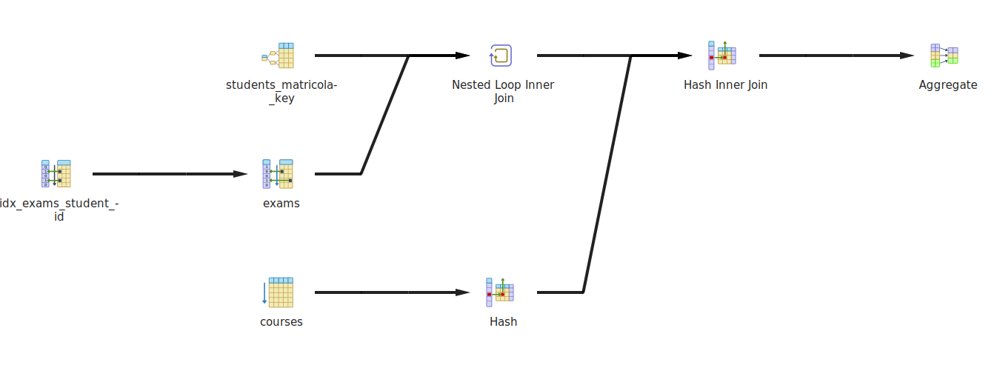
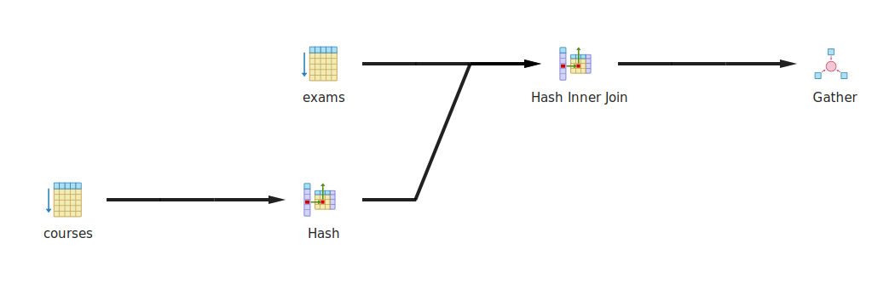
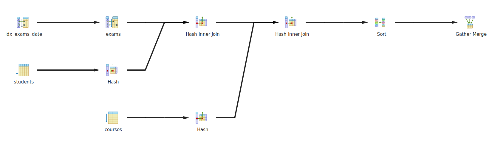

# Introduzione

Questo elaborato mostra la misurazione e l'ottimizzazione delle prestazioni di un database relazionale sottoposto a un set di query, scelte per tentare di osservare il cambiamento delle strategie scelte dall'ottimizzatore. Lo scopo è dimostrare come la progettazione degli indici consenta di abbattere i costi computazionali e di I/O.

Per garantire l'isolamento e la riproducibilità dell'ambiente di test, l'infrastruttura è stata implementata tramite container.
Come DBMS è stato scelto _PostgreSQL 16_ e per l'amministrazione _pgAdmin 4_, in esecuzione tramite Docker su un Apple MacBook Pro 16 con processore Apple M1 Pro e 16 GB di RAM.

Il progetto simula il database, in versione chiaramente semplificata, di un sistema informativo di un ateneo universitario. Lo schema comprende le seguenti tabelle:

* `courses` ($100$ ennuple).
* `students` ($50.000$ ennuple)
* `exams` ($15.000.000$ di ennuple), che traccia lo storico degli esiti.
	
Ove possibile, si è cercato di ottimizzare la dimensione dei tipi di dato. Ad esempio, per i campi `credits` e `grade` è stato utilizzato il tipo di dato `SMALLINT` (2 byte) anziché il canonico `INTEGER` (4 byte).

``` sql  {style=csnotes}
CREATE TABLE courses (
    course_id SERIAL PRIMARY KEY,
    course_code VARCHAR(10) UNIQUE NOT NULL,
    course_name VARCHAR(100) NOT NULL,
    credits SMALLINT NOT NULL CHECK (credits > 0 AND credits <= 18),
    department VARCHAR(50) NOT NULL
);

CREATE TABLE students (
    student_id SERIAL PRIMARY KEY,
    matricola VARCHAR(20) UNIQUE NOT NULL,
    first_name VARCHAR(50) NOT NULL,
    last_name VARCHAR(50) NOT NULL,
    enrollment_year SMALLINT NOT NULL
);

CREATE TABLE exams (
    exam_id SERIAL PRIMARY KEY,
    student_id INTEGER NOT NULL,
    course_id INTEGER NOT NULL,
    exam_date DATE NOT NULL,
    grade SMALLINT NOT NULL CHECK (grade >= 18 AND grade <= 31), -- 31 = 30 e lode
    
    CONSTRAINT fk_student FOREIGN KEY (student_id) REFERENCES students (student_id),
    CONSTRAINT fk_course FOREIGN KEY (course_id) REFERENCES courses (course_id)
);
```

# Generazione dei dati

Al fine di generare un volume di dati sufficiente a innescare i meccanismi di ottimizzazione avanzata del DBMS è stato utlizzato il seguente script Python. Si è scelto di utilizzare la libreria _Faker_ per generare dati fittizi ma realistici.

\scriptsize
```python  {style=csnotes}
# SEZIONE DI IMPORT E CONFIGURAZIONE OMESSA, vedere script allegato
NUM_COURSES = 100
NUM_STUDENTS = 50000
NUM_EXAMS = 15000000
# .......
def generate_courses(conn):
    print(f"Generazione di {NUM_COURSES} corsi...")
    courses = []
    departments = ["Informatica", "Matematica", "Fisica", "Ingegneria", "Economia"]
    for _ in range(NUM_COURSES):
        courses.append(
            (
                fake.unique.bothify(text="???-####").upper(),
                fake.catch_phrase()[:100],
                random.choice([6, 9, 12]),
                random.choice(departments),
            )
        )

    with conn.cursor() as cur:
        execute_values(
            cur,
            "INSERT INTO courses (course_code, course_name, credits, department) VALUES %s",
            courses,
        )
    conn.commit()


def generate_students(conn):
    print(f"Generazione di {NUM_STUDENTS} studenti...")
    students = []
    for _ in range(NUM_STUDENTS):
        students.append(
            (
                fake.unique.bothify(text="MATR#######"),
                fake.first_name(),
                fake.last_name(),
                random.randint(2015, 2024),
            )
        )

    batch_size = 10000
    with conn.cursor() as cur:
        for i in range(0, len(students), batch_size):
            execute_values(
                cur,
                "INSERT INTO students (matricola, first_name, last_name, enrollment_year) VALUES %s",
                students[i : i + batch_size],
            )
    conn.commit()


def generate_exams(conn):
    print(f"Generazione di {NUM_EXAMS} esami...")
    exams = []
    start_date = date(2015, 1, 1)
    for _ in range(NUM_EXAMS):
        random_days = random.randint(0, 3200)
        exam_date = start_date + timedelta(days=random_days)

        exams.append(
            (
                random.randint(1, NUM_STUDENTS),
                random.randint(1, NUM_COURSES),
                exam_date,
                random.randint(18, 31),
            )
        )

    batch_size = 20000
    with conn.cursor() as cur:
        for i in range(0, len(exams), batch_size):
            execute_values(
                cur,
                "INSERT INTO exams (student_id, course_id, exam_date, grade) VALUES %s",
                exams[i : i + batch_size],
            )
            if (i % 200000 == 0) and i > 0:
                print(f"... inseriti {i} esami")
    conn.commit()


def main():
    try:
        conn = psycopg2.connect(**PARAMS)

        generate_courses(conn)
        generate_students(conn)
        generate_exams(conn)

        conn.close()
    except Exception as e:
        print(f"Errore: {e}")
```
\normalsize

# Analisi e Misurazione delle Performance

Per testare il comportamento del sistema, sono state progettate tre query di complessità crescente:

``` sql  {style=csnotes}
-- Query 1> Elenco degli esami superati con lode nel dipartimento di informatica 
EXPLAIN (ANALYZE, BUFFERS)
SELECT c.course_name, e.exam_date, e.grade
FROM exams e
JOIN courses c ON e.course_id = c.course_id
WHERE c.department = 'Informatica' AND e.grade = 31;
```

``` sql  {style=csnotes}
-- Query 2> Elenco degli esami dell'anno solare 2023 con voto superiore a 28, ordinati per data
EXPLAIN (ANALYZE, BUFFERS)
SELECT s.matricola, c.course_name, e.grade, e.exam_date
FROM exams e
JOIN students s ON e.student_id = s.student_id
JOIN courses c ON e.course_id = c.course_id
WHERE e.grade >= 28 AND e.exam_date >= '2023-01-01' AND e.exam_date <= '2023-12-31'
ORDER BY e.exam_date DESC;
```

``` sql  {style=csnotes}
-- Query 3> Calcolo della media pesata e dei crediti totali acquisiti da una data matricola 
EXPLAIN (ANALYZE, BUFFERS)
SELECT s.matricola, s.first_name, s.last_name,
       SUM(c.credits) AS total_credits,
       ROUND(AVG(e.grade), 2) AS average_grade
FROM exams e
JOIN students s ON e.student_id = s.student_id
JOIN courses c ON e.course_id = c.course_id
WHERE s.matricola = 'MATR1332760' AND e.grade >= 18 
GROUP BY s.student_id, s.matricola, s.first_name, s.last_name;
```

Per valutare l'efficienza reale degli algoritmi di accesso ai dati, è stato utilizzato il comando: `EXPLAIN (ANALYZE, BUFFERS)`. L'attenzione si è concentrata sulla metrica `Buffer`, che riporta l'esatto ammontare di I/O generato suddiviso in `hit` per la lettura in RAM e `read` per l'accesso a memoria secondaria, rivelando il vero costo dell'interrogazione. 

## Pre-aggiornamento 
Di seguito vengono riportati i report estratti dalla console di pgAdmin generati dall'esecuzione delle tre query, subito dopo la popolazione della base di dati, prima dell'aggiornamento delle statistiche.

\tiny
```csv {style=rawlog}
-- Query 1
Gather  (cost=1003.54..199994.21 rows=241272 width=40) (actual time=13.873..425.415 rows=245523 loops=1)
  Workers Planned: 2
  Workers Launched: 2
  Buffers: shared hit=11283 read=84381
  ->  Hash Join  (cost=3.54..174867.01 rows=100530 width=40) (actual time=12.894..385.933 rows=81841 loops=3)
        Hash Cond: (e.course_id = c.course_id)
        Buffers: shared hit=11283 read=84381
        ->  Parallel Seq Scan on exams e  (cost=0.00..173667.49 rows=437086 width=10) (actual time=12.568..343.008 rows=356537 loops=3)
              Filter: (grade = 31)
              Rows Removed by Filter: 4643463
              Buffers: shared hit=11161 read=84381
        ->  Hash  (cost=3.25..3.25 rows=23 width=38) (actual time=0.070..0.070 rows=23 loops=3)
              Buckets: 1024  Batches: 1  Memory Usage: 10kB
              Buffers: shared hit=6
              ->  Seq Scan on courses c  (cost=0.00..3.25 rows=23 width=38) (actual time=0.038..0.052 rows=23 loops=3)
                    Filter: ((department)::text = 'Informatica'::text)
                    Rows Removed by Filter: 77
                    Buffers: shared hit=6
Planning:
  Buffers: shared hit=4
Planning Time: 0.491 ms
JIT:
  Functions: 45
  Options: Inlining false, Optimization false, Expressions true, Deforming true
  Timing: Generation 3.963 ms, Inlining 0.000 ms, Optimization 2.424 ms, Emission 35.090 ms, Total 41.477 ms
Execution Time: 438.012 ms
//////////////////////////////////////////////////////////////////////////////////////////////////////////
-- Query 2
Gather Merge  (cost=227412.20..264397.41 rows=316994 width=52) (actual time=467.966..523.407 rows=373213 loops=1)
  Workers Planned: 2
  Workers Launched: 2
  Buffers: shared hit=12715 read=84189, temp read=2924 written=2933
  ->  Sort  (cost=226412.17..226808.42 rows=158497 width=52) (actual time=451.360..462.212 rows=124404 loops=3)
        Sort Key: e.exam_date DESC
        Sort Method: external merge  Disk: 8072kB
        Buffers: shared hit=12715 read=84189, temp read=2924 written=2933
        Worker 0:  Sort Method: external merge  Disk: 7600kB
        Worker 1:  Sort Method: external merge  Disk: 7720kB
        ->  Hash Join  (cost=1537.25..207304.71 rows=158497 width=52) (actual time=44.818..414.077 rows=124404 loops=3)
              Hash Cond: (e.course_id = c.course_id)
              Buffers: shared hit=12641 read=84189
              ->  Hash Join  (cost=1533.00..206866.77 rows=158497 width=22) (actual time=21.005..368.954 rows=124404 loops=3)
                    Hash Cond: (e.student_id = s.student_id)
                    Buffers: shared hit=12577 read=84189
                    ->  Parallel Seq Scan on exams e  (cost=0.00..204917.69 rows=158497 width=14) (actual time=0.065..292.460 rows=124404 loops=3)
                          Filter: ((grade >= 28) AND (exam_date >= '2023-01-01'::date) AND (exam_date <= '2023-12-31'::date))
                          Rows Removed by Filter: 4875596
                          Buffers: shared hit=11353 read=84189
                    ->  Hash  (cost=908.00..908.00 rows=50000 width=16) (actual time=20.773..20.774 rows=50000 loops=3)
                          Buckets: 65536  Batches: 1  Memory Usage: 2856kB
                          Buffers: shared hit=1224
                          ->  Seq Scan on students s  (cost=0.00..908.00 rows=50000 width=16) (actual time=0.017..6.867 rows=50000 loops=3)
                                Buffers: shared hit=1224
              ->  Hash  (cost=3.00..3.00 rows=100 width=38) (actual time=23.734..23.734 rows=100 loops=3)
                    Buckets: 1024  Batches: 1  Memory Usage: 16kB
                    Buffers: shared hit=6
                    ->  Seq Scan on courses c  (cost=0.00..3.00 rows=100 width=38) (actual time=23.681..23.701 rows=100 loops=3)
                          Buffers: shared hit=6
Planning:
  Buffers: shared hit=10
Planning Time: 0.355 ms
JIT:
  Functions: 63
  Options: Inlining false, Optimization false, Expressions true, Deforming true
  Timing: Generation 4.498 ms, Inlining 0.000 ms, Optimization 2.212 ms, Emission 68.889 ms, Total 75.599 ms
Execution Time: 538.339 ms

//////////////////////////////////////////////////////////////////////////////////////////////////////////
-- Query 3
Finalize GroupAggregate  (cost=191092.52..191094.04 rows=1 width=71) (actual time=855.764..860.047 rows=1 loops=1)
  Group Key: s.student_id
  Buffers: shared hit=11592 read=83997
  ->  Gather Merge  (cost=191092.52..191094.01 rows=2 width=71) (actual time=855.750..860.034 rows=3 loops=1)
        Workers Planned: 2
        Workers Launched: 2
        Buffers: shared hit=11592 read=83997
        ->  Partial GroupAggregate  (cost=190092.50..190093.76 rows=1 width=71) (actual time=832.421..832.424 rows=1 loops=3)
              Group Key: s.student_id
              Buffers: shared hit=11592 read=83997
              ->  Sort  (cost=190092.50..190092.81 rows=125 width=35) (actual time=832.369..832.376 rows=95 loops=3)
                    Sort Key: s.student_id
                    Sort Method: quicksort  Memory: 31kB
                    Buffers: shared hit=11592 read=83997
                    Worker 0:  Sort Method: quicksort  Memory: 31kB
                    Worker 1:  Sort Method: quicksort  Memory: 30kB
                    ->  Hash Join  (cost=12.57..190088.14 rows=125 width=35) (actual time=45.317..832.176 rows=95 loops=3)
                          Hash Cond: (e.course_id = c.course_id)
                          Buffers: shared hit=11578 read=83997
                          ->  Hash Join  (cost=8.32..190083.55 rows=125 width=37) (actual time=14.849..801.571 rows=95 loops=3)
                                Hash Cond: (e.student_id = s.student_id)
                                Buffers: shared hit=11556 read=83997
                                ->  Parallel Seq Scan on exams e  (cost=0.00..173667.49 rows=6250039 width=10) (actual time=0.047..496.378 rows=5000000 loops=3)
                                      Filter: (grade >= 18)
                                      Buffers: shared hit=11545 read=83997
                                ->  Hash  (cost=8.31..8.31 rows=1 width=31) (actual time=0.040..0.041 rows=1 loops=3)
                                      Buckets: 1024  Batches: 1  Memory Usage: 9kB
                                      Buffers: shared hit=11
                                      ->  Index Scan using students_matricola_key on students s  (cost=0.29..8.31 rows=1 width=31) (actual time=0.034..0.035 rows=1 loops=3)
                                            Index Cond: ((matricola)::text = 'MATR3987004'::text)
                                            Buffers: shared hit=11
                          ->  Hash  (cost=3.00..3.00 rows=100 width=6) (actual time=30.427..30.427 rows=100 loops=3)
                                Buckets: 1024  Batches: 1  Memory Usage: 12kB
                                Buffers: shared hit=6
                                ->  Seq Scan on courses c  (cost=0.00..3.00 rows=100 width=6) (actual time=30.386..30.402 rows=100 loops=3)
                                      Buffers: shared hit=6
Planning:
  Buffers: shared hit=12
Planning Time: 0.616 ms
JIT:
  Functions: 87
  Options: Inlining false, Optimization false, Expressions true, Deforming true
  Timing: Generation 10.698 ms, Inlining 0.000 ms, Optimization 2.507 ms, Emission 88.727 ms, Total 101.932 ms
Execution Time: 861.766 ms

```
\normalsize

## Post-aggiornamento
Dopo aver eseguito una prima volta le query, è stato lanciato il comando: `ANALYZE exams, students, courses`. Questa operazione ha forzato il DBMS ad analizzare i dati inseriti e ad aggiornare la tabella di catalogo `pg_statistic`, fornendo all'ottimizzatore le stime corrette per calcolare i piani di esecuzione.

\tiny
```csv {style=rawlog}
-- Query 1
Gather  (cost=1003.54..201201.21 rows=252772 width=40) (actual time=18.325..501.288 rows=245523 loops=1)
  Workers Planned: 2
  Workers Launched: 2
  Buffers: shared hit=11795 read=83869
  ->  Hash Join  (cost=3.54..174924.01 rows=105322 width=40) (actual time=13.337..453.572 rows=81841 loops=3)
        Hash Cond: (e.course_id = c.course_id)
        Buffers: shared hit=11795 read=83869
        ->  Parallel Seq Scan on exams e  (cost=0.00..173667.49 rows=457920 width=10) (actual time=13.030..412.919 rows=356537 loops=3)
              Filter: (grade = 31)
              Rows Removed by Filter: 4643463
              Buffers: shared hit=11673 read=83869
        ->  Hash  (cost=3.25..3.25 rows=23 width=38) (actual time=0.069..0.070 rows=23 loops=3)
              Buckets: 1024  Batches: 1  Memory Usage: 10kB
              Buffers: shared hit=6
              ->  Seq Scan on courses c  (cost=0.00..3.25 rows=23 width=38) (actual time=0.036..0.053 rows=23 loops=3)
                    Filter: ((department)::text = 'Informatica'::text)
                    Rows Removed by Filter: 77
                    Buffers: shared hit=6
Planning:
  Buffers: shared hit=27
Planning Time: 1.014 ms
JIT:
  Functions: 45
  Options: Inlining false, Optimization false, Expressions true, Deforming true
  Timing: Generation 5.794 ms, Inlining 0.000 ms, Optimization 3.417 ms, Emission 35.292 ms, Total 44.504 ms
Execution Time: 515.011 ms
//////////////////////////////////////////////////////////////////////////////////////////////////////////
-- Query 2
Gather Merge  (cost=226984.54..263216.51 rows=310538 width=52) (actual time=655.229..716.333 rows=373213 loops=1)
  Workers Planned: 2
  Workers Launched: 2
  Buffers: shared hit=13084 read=83820, temp read=2923 written=2932
  ->  Sort  (cost=225984.52..226372.69 rows=155269 width=52) (actual time=632.006..644.503 rows=124404 loops=3)
        Sort Key: e.exam_date DESC
        Sort Method: external merge  Disk: 8184kB
        Buffers: shared hit=13084 read=83820, temp read=2923 written=2932
        Worker 0:  Sort Method: external merge  Disk: 7544kB
        Worker 1:  Sort Method: external merge  Disk: 7656kB
        ->  Hash Join  (cost=1537.25..207287.41 rows=155269 width=52) (actual time=27.309..583.322 rows=124404 loops=3)
              Hash Cond: (e.course_id = c.course_id)
              Buffers: shared hit=13010 read=83820
              ->  Hash Join  (cost=1533.00..206858.30 rows=155269 width=22) (actual time=16.517..548.422 rows=124404 loops=3)
                    Hash Cond: (e.student_id = s.student_id)
                    Buffers: shared hit=12946 read=83820
                    ->  Parallel Seq Scan on exams e  (cost=0.00..204917.69 rows=155269 width=14) (actual time=0.065..466.682 rows=124404 loops=3)
                          Filter: ((grade >= 28) AND (exam_date >= '2023-01-01'::date) AND (exam_date <= '2023-12-31'::date))
                          Rows Removed by Filter: 4875596
                          Buffers: shared hit=11722 read=83820
                    ->  Hash  (cost=908.00..908.00 rows=50000 width=16) (actual time=16.275..16.276 rows=50000 loops=3)
                          Buckets: 65536  Batches: 1  Memory Usage: 2856kB
                          Buffers: shared hit=1224
                          ->  Seq Scan on students s  (cost=0.00..908.00 rows=50000 width=16) (actual time=0.014..5.195 rows=50000 loops=3)
                                Buffers: shared hit=1224
              ->  Hash  (cost=3.00..3.00 rows=100 width=38) (actual time=10.669..10.670 rows=100 loops=3)
                    Buckets: 1024  Batches: 1  Memory Usage: 16kB
                    Buffers: shared hit=6
                    ->  Seq Scan on courses c  (cost=0.00..3.00 rows=100 width=38) (actual time=10.619..10.638 rows=100 loops=3)
                          Buffers: shared hit=6
Planning:
  Buffers: shared hit=19 dirtied=2
Planning Time: 0.906 ms
JIT:
  Functions: 63
  Options: Inlining false, Optimization false, Expressions true, Deforming true
  Timing: Generation 3.385 ms, Inlining 0.0 ms, Optimization 1.992 ms, Emission 29.911 ms, Total 35.288 ms
Execution Time: 731.171 ms
-- Query 3
Finalize GroupAggregate  (cost=191092.52..191094.04 rows=1 width=71) (actual time=824.624..830.068 rows=1 loops=1)
  Group Key: s.student_id
  Buffers: shared hit=11961 read=83628
  ->  Gather Merge (cost=191092.52..191094.01 rows=2 width=71)(actual time=824.610..830.053 rows=3 loops=1)
        Workers Planned: 2
        Workers Launched: 2
        Buffers: shared hit=11961 read=83628
        ->  Partial GroupAggregate  (cost=190092.50..190093.76 rows=1 width=71) (actual time=806.200..806.202 rows=1 loops=3)
              Group Key: s.student_id
              Buffers: shared hit=11961 read=83628
              ->  Sort  (cost=190092.50..190092.81 rows=125 width=35) (actual time=806.152..806.158 rows=95 loops=3)
                    Sort Key: s.student_id
                    Sort Method: quicksort  Memory: 30kB
                    Buffers: shared hit=11961 read=83628
                    Worker 0:  Sort Method: quicksort  Memory: 31kB
                    Worker 1:  Sort Method: quicksort  Memory: 31kB
                    ->  Hash Join  (cost=12.57..190088.14 rows=125 width=35) (actual time=28.997..805.962 rows=95 loops=3)
                          Hash Cond: (e.course_id = c.course_id)
                          Buffers: shared hit=11947 read=83628
                          ->  Hash Join  (cost=8.32..190083.55 rows=125 width=37) (actual time=11.841..788.660 rows=95 loops=3)
                                Hash Cond: (e.student_id = s.student_id)
                                Buffers: shared hit=11925 read=83628
                                ->  Parallel Seq Scan on exams e  (cost=0.00..173667.49 rows=6250039 width=10) (actual time=0.063..484.448 rows=5000000 loops=3)
                                      Filter: (grade >= 18)
                                      Buffers: shared hit=11914 read=83628
                                ->  Hash  (cost=8.31..8.31 rows=1 width=31) (actual time=0.055..0.056 rows=1 loops=3)
                                      Buckets: 1024  Batches: 1  Memory Usage: 9kB
                                      Buffers: shared hit=11
                                      ->  Index Scan using students_matricola_key on students s  (cost=0.29..8.31 rows=1 width=31) (actual time=0.047..0.048 rows=1 loops=3)
                                            Index Cond: ((matricola)::text = 'MATR3987004'::text)
                                            Buffers: shared hit=11
                          ->  Hash  (cost=3.00..3.00 rows=100 width=6) (actual time=17.126..17.126 rows=100 loops=3)
                                Buckets: 1024  Batches: 1  Memory Usage: 12kB
                                Buffers: shared hit=6
                                ->  Seq Scan on courses c  (cost=0.00..3.00 rows=100 width=6) (actual time=17.075..17.099 rows=100 loops=3)
                                      Buffers: shared hit=6
Planning: Buffers: shared hit=12
Planning Time: 0.326 ms
JIT:
  Functions: 87
  Options: Inlining false, Optimization false, Expressions true, Deforming true
  Timing: Generation 4.780 ms, Inlining 0.0 ms, Optimization 1.883 ms, Emission 49.437 ms, Total 56.10 ms
Execution Time: 832.184 ms
```

\normalsize

Tuttavia, le strategie sono rimaste le stesse e non si notano particolari cambiamenti né in termini di tempo, né in termini di scelta di operazioni.

## Strategia di Ottimizzazione

Per migliorare le inefficienze dei piani di esecuzione base (ad es. _Sequential Scan_ sull'intera tabella degli esami), è stata implementata una strategia di ottimizzazione basata su indici.

Poiché PostgreSQL non crea automaticamente gli indici per le _Foreign Key_, il primo passo è stato colmare questa lacuna. Gli indici sulle FK sono infatti fondamentali per ottimizzare le operazioni di `JOIN`, permettendo al DBMS di evitare la scansione dell'intera tabella `exams` durante il calcolo.
```sql
CREATE INDEX idx_exams_student_id ON exams(student_id);
CREATE INDEX idx_exams_course_id ON exams(course_id);

-- Per supportare le selezioni e le ricerche del carico di lavoro scelto, sono stati creati anche i seguenti indici:
CREATE INDEX idx_exams_date ON exams(exam_date DESC);
CREATE INDEX idx_courses_department ON courses(department);
```

Il campo `matricola` della tabella `students` ha già a disposizione un indice  creato implicitamente dal DBMS a supporto del vincolo di unicità.

## Inserimento indici

### Query 3

La query 3 era stata progettata per calcolare aggregazioni complesse (somma dei crediti e media dei voti) per un singolo studente, simulando una richiesta proveniente dal gestionale universitario. La query prevede operazioni di `JOIN` tra la tabella `exams` e le tabelle `students` e `courses`.

**Pre-Ottimizzazione**: eseguendo l'interrogazione con il comando `EXPLAIN (ANALYZE, BUFFERS)` in assenza di indici sulle chiavi esterne, il Query Planner di PostgreSQL ha generato un piano di esecuzione fortemente inefficiente (vd. console log nella sezione precedente). Dal log si evinceva chiaramente la scelta di eseguire un Parallel Seq Scan sulla tabella `exams`. L'ottimizzatore, probabilmente conscio dell'elevato numero di ennuple, ha allocato due worker paralleli nel tentativo di mitigare i tempi di scansione sequenziale. Nonostante questo espediente, l'esecuzione ha richiesto 832.184 ms.

Tuttavia, il dato più critico emerge dai costi di I/O:`Buffers: shared hit=11961 read=83628`.

Il sistema ha dovuto elaborare un totale di $95.589$ blocchi di memoria. Di questi, $83.628$ non erano presenti in cache e hanno richiesto una lettura dal disco (`read`). Questo comportamento mostra come, non avendo alternative, il DBMS sia costretto a scorrere l'intera tabella per isolare le ennuple relative a una singola matricola.

A seguito della creazione degli indici, l'esecuzione seguente ha mostrato un radicale cambio di paradigma algoritmico da parte del Query Planner.

\tiny

```csv {style=rawlog}
HashAggregate  (cost=1179.46..1179.47 rows=1 width=71) (actual time=1.038..1.041 rows=1 loops=1)
  Group Key: s.student_id
  Batches: 1  Memory Usage: 24kB
  Buffers: shared hit=293
  ->  Hash Join  (cost=11.30..1177.21 rows=300 width=35) (actual time=0.262..0.957 rows=285 loops=1)
        Hash Cond: (e.course_id = c.course_id)
        Buffers: shared hit=293
        ->  Nested Loop  (cost=7.05..1172.14 rows=300 width=37) (actual time=0.164..0.807 rows=285 loops=1)
              Buffers: shared hit=291
              ->  Index Scan using students_matricola_key on students s  (cost=0.29..8.31 rows=1 width=31) (actual time=0.030..0.032 rows=1 loops=1)
                    Index Cond: ((matricola)::text = 'MATR3987004'::text)
                    Buffers: shared hit=3
              ->  Bitmap Heap Scan on exams e  (cost=6.76..1160.83 rows=300 width=10) (actual time=0.127..0.731 rows=285 loops=1)
                    Recheck Cond: (student_id = s.student_id)
                    Filter: (grade >= 18)
                    Heap Blocks: exact=285
                    Buffers: shared hit=288
                    ->  Bitmap Index Scan on idx_exams_student_id  (cost=0.00..6.68 rows=300 width=0) (actual time=0.089..0.089 rows=285 loops=1)
                          Index Cond: (student_id = s.student_id)
                          Buffers: shared hit=3
        ->  Hash  (cost=3.00..3.00 rows=100 width=6) (actual time=0.055..0.055 rows=100 loops=1)
              Buckets: 1024  Batches: 1  Memory Usage: 12kB
              Buffers: shared hit=2
              ->  Seq Scan on courses c  (cost=0.00..3.00 rows=100 width=6) (actual time=0.013..0.024 rows=100 loops=1)
                    Buffers: shared hit=2
Planning:
  Buffers: shared hit=20
Planning Time: 0.721 ms
Execution Time: 1.170 ms
```
\normalsize

{latex-placement="h"}

L'accesso sequenziale è stato scartato in favore di un Bitmap Index Scan seguito da un Bitmap Heap Scan. L'indice ha infatti permesso al DBMS di individuare istantaneamente le ennuple richieste.

I vantaggi misurati sono evidenti: il consumo di buffer è precipitato a `shared hit=293`; le letture fisiche dal disco (`read`) sono state completamente azzerate; il tempo totale di esecuzione è sceso a $1.170$ ms.

L'introduzione dell'indice ha ridotto il tempo di esecuzione del $99.8\%$, ma il risultato più rilevante è la riduzione di letture dei blocchi di circa 326 volte (da 95.589 a 293 buffer). 

\newpage

### Query 1

\tiny
```csv {style=rawlog}
QUERY 1 Post-aggiunta indici: ////////////////////////////////////////////////////
Gather  (cost=1003.54..201200.51 rows=252770 width=40) (actual time=29.342..803.883 rows=245523 loops=1)
  Workers Planned: 2
  Workers Launched: 2
  Buffers: shared hit=12388 read=83276
  ->  Hash Join  (cost=3.54..174923.51 rows=105321 width=40) (actual time=21.425..737.082 rows=81841 loops=3)
        Hash Cond: (e.course_id = c.course_id)
        Buffers: shared hit=12388 read=83276
        ->  Parallel Seq Scan on exams e  (cost=0.00..173667.00 rows=457917 width=10) (actual time=21.091..698.052 rows=356537 loops=3)
              Filter: (grade = 31)
              Rows Removed by Filter: 4643463
              Buffers: shared hit=12266 read=83276
        ->  Hash  (cost=3.25..3.25 rows=23 width=38) (actual time=0.071..0.072 rows=23 loops=3)
              Buckets: 1024  Batches: 1  Memory Usage: 10kB
              Buffers: shared hit=6
              ->  Seq Scan on courses c  (cost=0.00..3.25 rows=23 width=38) (actual time=0.043..0.055 rows=23 loops=3)
                    Filter: ((department)::text = 'Informatica'::text)
                    Rows Removed by Filter: 77
                    Buffers: shared hit=6
Planning:
  Buffers: shared hit=76 read=5
Planning Time: 2.015 ms
JIT:
  Functions: 45
  Options: Inlining false, Optimization false, Expressions true, Deforming true
  Timing: Generation 5.166 ms, Inlining 0.000 ms, Optimization 3.882 ms, Emission 57.795 ms, Total 66.843 ms
Execution Time: 819.035 ms
```
\normalsize

Contrariamente all'abbattimento drastico dei costi osservato nella query 3, l'analisi dei piani di esecuzione post-ottimizzazione per la query 1 non mostra differenze. Nonostante l'istanziazione degli indici, il DBMS ha deliberatamente scelto di ignorarli, prediligendo un metodo di accesso sequenziale `Parallel Seq Scan on exams e (.....)`.

Questo scenario non rappresenta, in realtà, un completo fallimento della strategia di tuning, bensì una dimostrazione dell'operato del Cost-Based Optimizer del DBMS. La decisione ruota attorno alla selettività del predicato. Sfruttare un indice è computazionalmente vantaggioso solo quando il predicato è altamente selettivo, mentre la query in questione lo era poco. 
Se il database utilizzasse l'indice per estrarre le $350.000$ righe, sarebbe costretto a eseguire centinaia di migliaia di accessi casuali al disco o alla memoria RAM, rimbalzando continuamente tra i blocchi dell'indice e quelli della tabella.

Il Query Planner, anche grazie alle statistiche aggiornate in precedenza tramite il comando `ANALYZE`, ha stimato questo costo e dedotto che eseguire una scansione completa e sequenziale dei blocchi della tabella distribuendo il carico su più core della CPU (`Workers Launched: 2`) avrebbe prodotto un costo computazionale complessivo inferiore rispetto all'overhead generato da un Index Scan.

{latex-placement="h"}

### Query 2

La query 2 presenta un filtraggio combinato (su un arco temporale e una soglia di voto) e un ordinamento dei risultati sulla base della data(`ORDER BY e.exam_date DESC`).

\tiny

```csv {style=rawlog}
QUERY 2 Post-aggiunta indici: ////////////////////////////////////////////////////
Gather Merge  (cost=210522.60..246795.40 rows=310888 width=52) (actual time=1233.593..1315.599 rows=373213 loops=1)
  Workers Planned: 2
  Workers Launched: 2
  Buffers: shared hit=1307 read=96656 written=14, temp read=2923 written=2932
  ->  Sort  (cost=209522.58..209911.19 rows=155444 width=52) (actual time=1182.057..1194.266 rows=124404 loops=3)
        Sort Key: e.exam_date DESC
        Sort Method: external merge  Disk: 7728kB
        Buffers: shared hit=1307 read=96656 written=14, temp read=2923 written=2932
        Worker 0:  Sort Method: external merge  Disk: 7848kB
        Worker 1:  Sort Method: external merge  Disk: 7808kB
        ->  Hash Join  (cost=19278.14..190802.12 rows=155444 width=52) (actual time=124.003..1126.190 rows=124404 loops=3)
              Hash Cond: (e.course_id = c.course_id)
              Buffers: shared hit=1291 read=96656 written=14
              ->  Hash Join  (cost=19273.89..190372.54 rows=155444 width=22) (actual time=104.787..1076.919 rows=124404 loops=3)
                    Hash Cond: (e.student_id = s.student_id)
                    Buffers: shared hit=1227 read=96656 written=14
                    ->  Parallel Bitmap Heap Scan on exams e  (cost=17740.89..188431.46 rows=155444 width=14) (actual time=85.449..981.625 rows=124404 loops=3)
                          Recheck Cond: ((exam_date >= '2023-01-01'::date) AND (exam_date <= '2023-12-31'::date))
                          Rows Removed by Index Recheck: 1583248
                          Filter: (grade >= 28)
                          Rows Removed by Filter: 310966
                          Heap Blocks: exact=20661 lossy=11013
                          Buffers: shared hit=3 read=96656 written=14
                          ->  Bitmap Index Scan on idx_exams_date  (cost=0.00..17647.62 rows=1313919 width=0) (actual time=102.892..102.893 rows=1306111 loops=1)
                                Index Cond: ((exam_date >= '2023-01-01'::date) AND (exam_date <= '2023-12-31'::date))
                                Buffers: shared hit=3 read=1114
                    ->  Hash  (cost=908.00..908.00 rows=50000 width=16) (actual time=19.108..19.109 rows=50000 loops=3)
                          Buckets: 65536  Batches: 1  Memory Usage: 2856kB
                          Buffers: shared hit=1224
                          ->  Seq Scan on students s  (cost=0.00..908.00 rows=50000 width=16) (actual time=0.031..7.534 rows=50000 loops=3)
                                Buffers: shared hit=1224
              ->  Hash  (cost=3.00..3.00 rows=100 width=38) (actual time=19.052..19.052 rows=100 loops=3)
                    Buckets: 1024  Batches: 1  Memory Usage: 16kB
                    Buffers: shared hit=6
                    ->  Seq Scan on courses c  (cost=0.00..3.00 rows=100 width=38) (actual time=18.994..19.019 rows=100 loops=3)
                          Buffers: shared hit=6
Planning:
  Buffers: shared hit=17 read=8
Planning Time: 3.530 ms
JIT:
  Functions: 69
  Options: Inlining false, Optimization false, Expressions true, Deforming true
  Timing: Generation 12.946 ms, Inlining 0.0 ms, Optimization 3.899 ms, Emission 52.995 ms, Total 69.840 ms
Execution Time: 1335.699 ms

```
\normalsize

In questa query invece, l'ottimizzatore sceglie di sfruttare gli indici (`idx_exams_date`), abbandonando il **Parallel Seq Scan** sulla tabella esami in favore di un **Bitmap heap scan** seguito da un **Bitmap index scan**. 
Tuttavia questa strategia non si è rivelata molto efficace, in quanto la bitmap è divenuta troppo grande e il DBMS l'ha dovuta ridurre tracciando i blocchi (la parte lossy di `Heap Blocks: exact=20661 lossy=11013`) anziché le singole ennuple. Ciò è stato dovuto alla bassa selettività del predicato.
Tutti i blocchi "lossy" sono dovuti essere ricaricati in memoria e singolarmente controllati, ennupla per ennupla, per valutare la condizione sulla data, come mostrato da `Rows Removed by Index Recheck: 1583248`. Il risultato è un sensibile aumento del tempo di esecuzione della query. Per mitigare i problemi riscontrati, sarebbe utile definire un indice sia sulla data che sul voto dell'esame, per completare il filtraggio operando solo su indici.

{latex-placement="h"}

# Conclusioni 

Il presente progetto ha dimostrato l'impatto della progettazione degli indici sulle prestazioni di un DBMS. L'utilizzo degli strumenti di analizi messi a disposizione dal DBMS ha permesso di analizzare la sequenza di operazioni svolte dal sistema e ottenere una metrica basata sui costi di I/O.

Nel contesto di interrogazioni altamente selettive (come la Query 3), l'implementazione di indici sulle chiavi esterne si è rivelata risolutiva. L'azzeramento delle letture fisiche su disco (`read=0`) e il passaggio da un _Sequential Scan_ a un _Bitmap Heap Scan_ hanno abbattuto di molto i tempi di esecuzione. 
Si è visto inoltre che l'indice non rappresenta una soluzione universale, ma uno strumento che va contestualizzato in base alla selettività dei dati richiesti, onde evitare gli elevati costi di accesso casuale a memoria secondaria.

L'aggiunta di strutture fisiche supplementari ha sicuramente comportato un consumo maggiore di spazio su disco e introdurrà un overhead durante le operazioni di scrittura (`INSERT`, `UPDATE`, `DELETE`), poiché il DBMS dovrà mantenere aggiornati gli indici a seguito di ogni modifica.