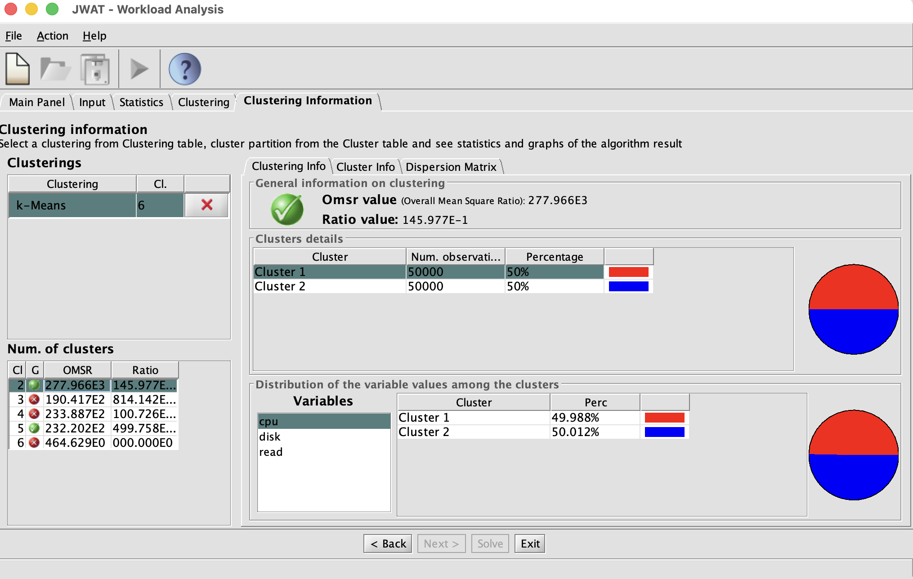
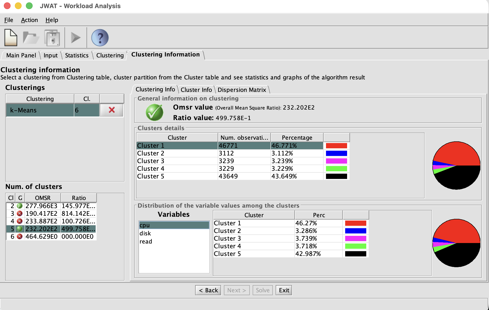
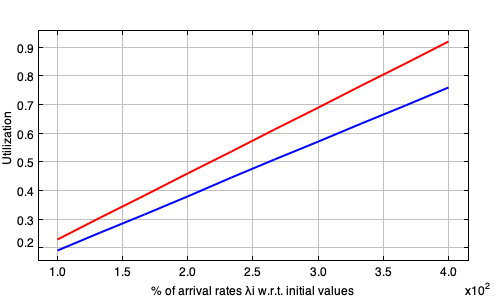
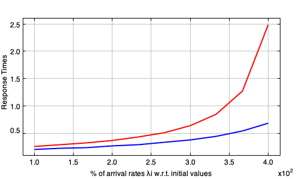
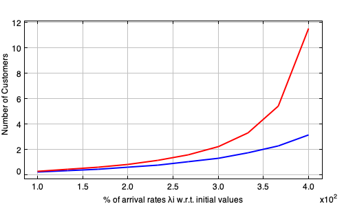
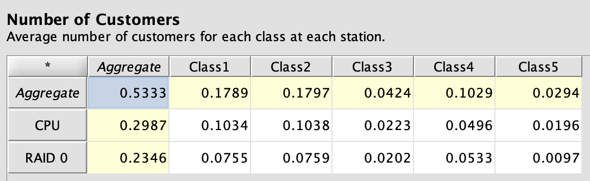
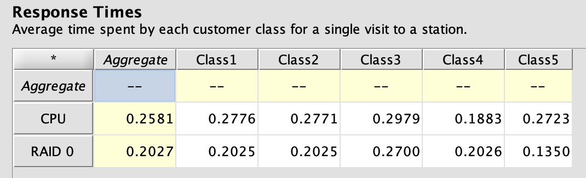
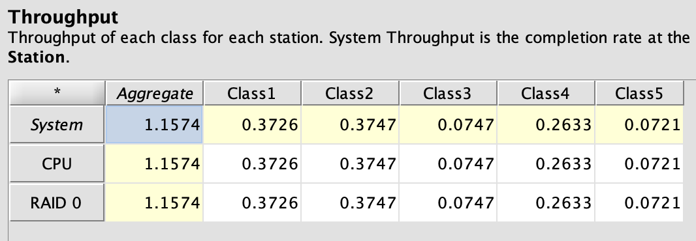
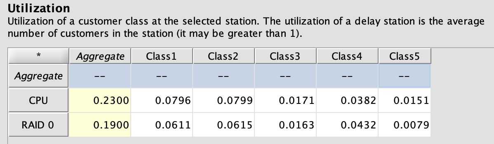
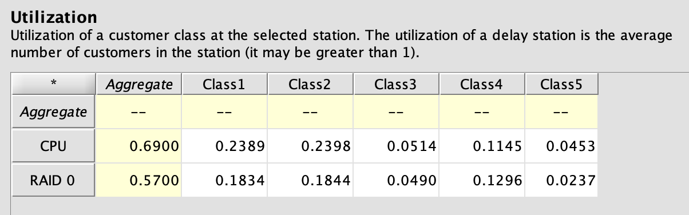

# Executive Summary
Breve riepilogo dei risultati principali, illustrati nel dettaglio nel prosieguo del documento. 

---

==RISPOSTA 1.1==: Tempo di risposta complessivo e per-componente

```python
R_cpu     = 258.08 ms
R_disk    = 202.67 ms

R_tot     = 460.75 ms
```

==RISPOSTA 1.2==: Numero medio di job 

```python
N_cpu     = 0.2986 jobs
N_disk    = 0.2345 jobs

N_job_tot = 0.5333 jobs
```

==RISPOSTA 2==: Throughput massimo $X_{max}$

```Python
X_max     = 3.52 tx/s
```
Ossia, nello scenario attuale è possibile triplicare il carico rispettando il tetto massimo di utilizzazione del 70\%.

==RISPOSTA 3.1==: Numero minimo di dischi passando in RAID-1 al $X_{max}$

Sono necessari **5 dischi** in configurazione RAID-1 per poter sostenere il carico massimo previsto rispettando i vincoli di utilizzazione

---

\newpage

# Introduzione 

L'obiettivo di questo progetto è la modellazione prestazionale di un DBMS analizzando una traccia di workload di $100.000$ transazioni, osservate su un periodo di $24$ ore. Il sistema è composto da una singola CPU e da un array di $2$ dischi in configurazione RAID-0 (ciò comporta che letture e scritture siano egualmente divise tra i due dischi).

Inoltre, vengono fornite le seguenti informazioni:

- Utilizzazione media CPU  $U_{cpu} = 0.23$
- Utilizzazione media RAID $U_{raid} = 0.19$

# Calcoli preliminari
Per cominciare, si è provveduto a svolgere tutti i relativi calcoli per la determinazione dei valori necessari a rispondere ai quesiti dei punti 1, 2, e 3 della traccia del progetto.

## Throughput
Il throughput del sistema si può calcolare con la formula $X = N / T$, con $N$ = numero di transazioni, ossia il numero di righe della traccia, e $T = 24 \cdot 60 \cdot 60 = 86.400 s$, il numero di secondi in $24$ ore. Facendo i conti, si ottiene che il throughput è pari a $X = 100.000 / 86400 = 1,157 \text{ tx/s}$

## Service demand 
La service demand $D_i$ è il tempo totale di servizio che una transazione spende in media al centro $i$. Si ricava dalla Service Demand Law: $D_{i}=\frac{B_{i}}{C_{0}}=\frac{U_{i} \times T}{C_{0}}=\frac{U_{i}}{C_{0}/T}=\frac{U_{i}}{X_{0}}$.

A seguito di analisi svolte con il software JMT, è emerso che le transazioni contenute nella traccia potrebbero essere raggruppate in $2$ o, preferibilmente, $5$ cluster per meglio rappresentare analiticamente il sistema e il relativo workload caratteristico in questione.





Per ulteriormente comprendere la struttura del workload, è stato realizzato anche il seguente scatter plot:


### Service demand CPU

Il tempo CPU medio si potrebbe ricavare calcolando la media o mediana della colonna CPU Time, ottenendo

```python
D_cpu = df["CPU Time"].mean()=2.05 (unità tempo di CPU)
```

Tuttavia, l'unità di misura nella traccia è ignota e, calcolando la service demand media tramite l'utilizzazione fornita e la Service Demand Law  $(D = \frac {U} {X})$, essa dovrebbe essere pari a $D_{cpu} =  0.19872 s \times 1000 =198.72 ms$

Dunque sarà questo il valore che prenderemo in considerazione. Seppur non rilevante per il seguito dell'elaborato, si rileva che $1$ unita di tempo CPU corrisponde a

```python
1 unità = (u_cpu / X * 1000) / df['CPU Time'].mean() = 96.95 millisecondi
```

### Service demand RAID-0

Il tempo per visita al disco non è nella traccia, quindi usiamo la Service Demand Law con il dato fornito: sostituendo i valori dati $U_{raid} = 19\%$ e $X      = 100.000 tx$, otteniamo che $D_{disk} = \frac {0.19} {1.157} \times 1000= 164.16 ms$

Da qui si ricava anche il tempo medio di servizio per singola visita:

```python
mediana_num_visite : df['I/O on Disk'].mean()    = 3 visite/transazione
tempo di servizio  : D_disk / mediana_num_visite = 54.72 millisecondi/visita
```
> Considerazione: il disco pare non essere particolarmente performante secondo gli standard moderni.

## Calcolo con cluster

Calcolando le service demands dei cluster in base all'appartenenza delle transazioni con l'ausilio di uno script Python che applica le formule sopra descritte, si ottengono i seguenti valori:

```bash
CLUSTER 1 (32189 tx, 32.2%):
  - Throughput (X_c) : 0.3726 tx/s
  - Service Demand   : D_cpu = 213.73 ms | D_disk = 164.03 ms
  - % Read medio     : 90.1%
  
CLUSTER 2 (32371 tx, 32.4%):
  - Throughput (X_c) : 0.3747 tx/s
  - Service Demand   : D_cpu = 213.33 ms | D_disk = 164.03 ms
  - % Read medio     : 10.0%
  
CLUSTER 3 (6453 tx, 6.5%):
  - Throughput (X_c) : 0.0747 tx/s
  - Service Demand   : D_cpu = 229.36 ms | D_disk = 218.71 ms
  - % Read medio     : 50.1%
  
CLUSTER 4 (22754 tx, 22.8%):
  - Throughput (X_c) : 0.2634 tx/s
  - Service Demand   : D_cpu = 145.01 ms | D_disk = 164.07 ms
  - % Read medio     : 50.3%
  
CLUSTER 5 (6233 tx, 6.2%):
  - Throughput (X_c) : 0.0721 tx/s
  - Service Demand   : D_cpu = 209.66 ms | D_disk = 109.35 ms
  - % Read medio     : 50.0%
```

# Passo 1 — Tempo di Risposta e Job Medi

A partire dai valori ottenuti, è stato realizzato un modello del sistema con JMT per ottenere i valori dei tempi di risposta e dei job medi.
Il modello è composto da:

- 5 classi di customers (derivate dai 5 cluster), il cui _Arrival Rate_ è pari al throughput del cluster;
- 2 stazioni di servizio (CPU e RAID0) Load Independent;
- Per ogni classe, per ogni stazione di servizio, è stata impostata la _Service Demand_ ottenuta al paragrafo precedente.

Di seguito sono riepilogati i risultati ottenuti con JMT (JMVA).

## Tempo di risposta per centro

```bash
CLUSTER 1 (32189 tx, 32.2%):
  - Tempi Risposta   : R_cpu = 277.58 ms | R_disk = 202.51 ms | R_tot = 480.08 ms

CLUSTER 2 (32371 tx, 32.4%):
  - Tempi Risposta   : R_cpu = 277.05 ms | R_disk = 202.51 ms | R_tot = 479.56 ms

CLUSTER 3 (6453 tx, 6.5%):
  - Tempi Risposta   : R_cpu = 297.87 ms | R_disk = 270.01 ms | R_tot = 567.88 ms

CLUSTER 4 (22754 tx, 22.8%):
  - Tempi Risposta   : R_cpu = 188.32 ms | R_disk = 202.55 ms | R_tot = 390.88 ms

CLUSTER 5 (6233 tx, 6.2%):
  - Tempi Risposta   : R_cpu = 272.29 ms | R_disk = 135.01 ms | R_tot = 407.30 ms

```

## ==RISPOSTA 1.1==: Tempo di risposta complessivo e per-componente

I risultati aggregati ottenuti da JMT sono:

```python
R_cpu  = 258.08 ms
R_disk = 202.67 ms
R_tot  = R_cpu  + R_disk = 460.75 ms
```

## ==RISPOSTA 1.2==: Numero medio di job 

Il numero medio di job complessivo del sistema calcolato con la Legge di Little sarebbe:
```python
N_job_tot = X · R_tot [in secondi] = 0.533 jobs
```

Scomponendo per centro:

```python
N_cpu  = X · R_cpu  = 0.2986 jobs
N_disk = X · R_disk = 0.2345 jobs
```

La scomposizione in cluster è riportata nel seguente blocco. Sommando le varie voci, si ottiene chiaramente il medesimo risultato.
```bash
CLUSTER 1 (32189 tx, 32.2%) N_job = 0.1789 jobs

CLUSTER 2 (32371 tx, 32.4%) N_job = 0.1797 jobs

CLUSTER 3 (6453 tx, 6.5%)   N_job = 0.0424 jobs

CLUSTER 4 (22754 tx, 22.8%) N_job = 0.1029 jobs

CLUSTER 5 (6233 tx, 6.2%)   N_job = 0.0294 jobs

```

I risultati sono stati poi confermati dai calcoli effettuati con JMT. 

# Passo 2 — Carico Massimo con Bottleneck $\leq 70\%$
Si richiede di trovare il carico massimo sostenibile mantenendo l'utilizzazione del collo di bottiglia $\le$ 70\%, supponendo un incremento proporzionale per tutte le classi di workload. Il centro collo di bottiglia del sistema attuale è la CPU, con un'utilizzazione di partenza del $23\%$.


## ==RISPOSTA 2==: Throughput massimo

Imponendo $U_{\text{bottleneck}} = 0.70$, si ottiene che il throughput massimo raggiungibile sarà pari a:

```bash
X_max = 0.70 / D_max [tx/s] 
      = 0.70 / 0.199 s = 3.52 tx/s
```

## ==RISPOSTA 2==: Incremento proporzionale su tutte le classi

Per calcolare il fattore massimo per il quale si può moltiplicare il workload attuale rispettando il limite del 70\%, si può dividere l'utilizzazione target per quella attuale del centro collo di bottiglia. Nel caso in esame,

$$
k =\frac{U_{target } : 0.70\%}{U_{max} : 0.23\%} = 3.04
$$

Dunque, nello scenario attuale è possibile triplicare il carico rispettando il tetto massimo di utilizzazione del 70\%.

I calcoli sono confermati dalla «What-if analysis» di JMT, eseguita supponendo un incremento dal 100% al 400% del tasso di arrivi (e quindi del throughput), di cui di seguito è riportato il grafico risultante. 

{latex-placement="h"}

Analizzando le risultanze dell'incremento per singoli cluster, si ottiene:
```bash
  - Cluster 1 -> X_c_max = X_c * k = 1.1339 tx/s
  - Cluster 2 -> X_c_max = X_c * k = 1.1403 tx/s
  - Cluster 3 -> X_c_max = X_c * k = 0.2273 tx/s
  - Cluster 4 -> X_c_max = X_c * k = 0.8015 tx/s
  - Cluster 5 -> X_c_max = X_c * k = 0.2196 tx/s
                                   +
  - Totale                         = 3.52   tx/s
```
Ne consegue che l'utilizzazione dell'array RAID-0 a seguito dell'incremento del workload sarà pari a $U_{disk}\cdot k = 0.19\% \cdot 3.04 = 0.578 \%$. 

Dalla _Figura 4_ si vede inoltre un'impennata del tempo di risposta specialmente per la CPU all'approcciare e al superare la soglia di $3\times$ dell'utilizzazione originaria, sintomo di una prossima saturazione.

{latex-placement="h"}

Parimenti e per la stessa motivazione, è osservabile un'impennata del numero di clienti nei due centri in _Figura 5_.




# Passo 3 — Passaggio a RAID-1

Infine, si è proceduto a valutare come effettuare la sostituzione dell'array RAID-0 di due dischi con una configurazione RAID-1 e $N$ dischi, mantenendo la capacità di sostenere il throughput massimo calcolato al punto precedente senza superare il 70% di utilizzo del collo di bottiglia. Il collo di bottiglia, finora, è stata la CPU che, a seguito dell'incremento di throughput, riporta un'utilizzazione del 70%.

In RAID-1 ogni disco è una copia degli altri. L'effetto sul carico dipende dunque dal tipo di operazione: ogni lettura è distribuita su tutti i dischi (e quindi in questo caso è come nel RAID-0), mentre ogni scrittura è replicata su tutti i dischi (quindi ci saranno $N$ scritture se si ha un array di $N$ dischi). Ciò implica un aumento dell'utilizzazione dei dischi. A questo punto diventa fondamentale l'informazione contenuta nella traccia riguardo la percentuale di letture nelle singole transazioni. 

Il collo di bottiglia, a seguito del cambio di configurazione da RAID-0 a RAID-1 sempre con 2 dischi, diventa l'array RAID-1 e non più la CPU in quanto, come verrà illustrato in seguito, si rileva un'utilizzazione iniziale del $86.73\%$

## Service demand per disco in RAID-1

Per calcolare la nuova utilizzazione dell'array RAID-1, sono stati calcolati i valori medi per cluster della percentuale di letture e, per complemento, delle scritture. Per chiarezza saranno individuate con $f_r = \frac {mean(\text{read percentage})} {100}$ e $f_w = 1 - f_r$. Con $N$ dischi in RAID-1 e a partire da un array RAID-0 di $2$ dischi, le service demands dei vari cluster sono state calcolate con la seguente formula:

$$
D_{disk\_RAID1} = D_{disk\_RAID0} \times 2 \times (\frac {f_r} N + f_w)
$$
In altre parole, a partire dalla service demand dell'array originale si è moltiplicato per 2 per ottenere il carico di lavoro per ogni disco (in RAID-0 il carico è diviso esattamente a metà) e poi si è moltiplicato per un fattore che scala la service demand in base alla composizione di letture e scritture.
`D_disk_RAID0` corrisponde alle service demands dei vari cluster calcolate precedentemente, e le percentuali di lettura sono state calcolate durante la fase preliminare. 

## ==RISPOSTA 3.1==: Numero minimo di dischi al throughput $X_{max}$

L'utilizzazione totale dell'array RAID-1 si ottiene sommando l'utilizzazione generata da ogni singolo cluster al throughput massimo:

$$U_{RAID1} = \sum_{c=1}^{5} \left( X_{max\\_c} \cdot D_{RAID1\\_c} \right) = \sum_{c=1}^{5} \left( U_{RAID1\\_c} \right)$$

Si è proceduto iterativamente, con l'ausilio di uno script in Python, alla ricerca del numero minimo di dischi $N \ge 2$ che consentisse di ottenere l'utilizzazione del collo di bottiglia inferiore al $70\%$.

Eseguendo il test con $N = 2,3,4$ dischi, si ha avuto esito negativo. L'utilizzazione, che decresce all'aumentare del numero dei dischi, nell'ultimo caso, si attestava al $72.27\%$, superando ancora il limite imposto.
```bash
--- TEST CONFIGURAZIONE: N = 2 dischi ---
  Cluster 1: D_RAID1 = 180.34 ms | U_disco = 20.45%
  Cluster 2: D_RAID1 = 311.70 ms | U_disco = 35.54%
  Cluster 3: D_RAID1 = 327.90 ms | U_disco =  7.45%
  Cluster 4: D_RAID1 = 245.57 ms | U_disco = 19.68%
  Cluster 5: D_RAID1 = 164.03 ms | U_disco =  3.60%
----------------------------------------
  > Utilizzo CPU Totale    : 70.00% (costante dal Passo 2)
  > Utilizzo RAID-1 Totale : 86.73%
  > COLLO DI BOTTIGLIA     : RAID-1 al 86.73%
X FALLITO: Il RAID-1 supera il 70%. Necessario aumentare i dischi.

--- TEST CONFIGURAZIONE: N = 3 dischi ---
  Cluster 1: D_RAID1 = 131.09 ms | U_disco = 14.86%
  Cluster 2: D_RAID1 = 306.24 ms | U_disco = 34.92%
  Cluster 3: D_RAID1 = 291.40 ms | U_disco =  6.62%
  Cluster 4: D_RAID1 = 218.04 ms | U_disco = 17.48%
  Cluster 5: D_RAID1 = 145.81 ms | U_disco =  3.20%
----------------------------------------
  > Utilizzo CPU Totale    : 70.00% (costante dal Passo 2)
  > Utilizzo RAID-1 Totale : 77.09%
  > COLLO DI BOTTIGLIA     : RAID-1 al 77.09%
X FALLITO: Il RAID-1 supera il 70%. Necessario aumentare i dischi.

--- TEST CONFIGURAZIONE: N = 4 dischi ---
  Cluster 1: D_RAID1 = 106.47 ms | U_disco = 12.07%
  Cluster 2: D_RAID1 = 303.51 ms | U_disco = 34.61%
  Cluster 3: D_RAID1 = 273.15 ms | U_disco =  6.21%
  Cluster 4: D_RAID1 = 204.28 ms | U_disco = 16.37%
  Cluster 5: D_RAID1 = 136.70 ms | U_disco =  3.00%
----------------------------------------
  > Utilizzo CPU Totale    : 70.00% (costante dal Passo 2)
  > Utilizzo RAID-1 Totale : 72.27%
  > COLLO DI BOTTIGLIA     : RAID-1 al 72.27%
X FALLITO: Il RAID-1 supera il 70%. Necessario aumentare i dischi.
```
Con 5 dischi, invece, si ha successo:

```bash
--- TEST CONFIGURAZIONE: N = 5 dischi ---
  Cluster 1: D_RAID1 =  91.70 ms | U_disco = 10.40%
  Cluster 2: D_RAID1 = 301.88 ms | U_disco = 34.42%
  Cluster 3: D_RAID1 = 262.20 ms | U_disco =  5.96%
  Cluster 4: D_RAID1 = 196.02 ms | U_disco = 15.71%
  Cluster 5: D_RAID1 = 131.23 ms | U_disco =  2.88%
----------------------------------------
  > Utilizzo CPU Totale    : 70.00% (costante dal Passo 2)
  > Utilizzo RAID-1 Totale : 69.37%
  > COLLO DI BOTTIGLIA     : CPU al 70.00%
SUCCESS: Trovata configurazione valida
```

L'utilizzazione scende al 69.37%, e sono dunque necessari **5 dischi** in configurazione RAID-1 per poter sostenere il carico massimo previsto rispettando i vincoli di utilizzazione.

<!-- ## Trovare il numero minimo di dischi

Si cerca il minimo intero N ≥ 2 tale che U_RAID1(N) ≤ 0.70. Si prova N = 2, 3, 4, … finché il vincolo è soddisfatto, oppure si risolve analiticamente:

```python
X_max · D_disk · (f_r/N + f_w·N) = 0.70
``` -->

RAID-1 con $N$ dischi tollera il guasto di $N−1$ dischi contemporaneamente. Per tollerare almeno $1$ guasto è sufficiente $N = 2$. Dai calcoli eseguiti, emerge che sono necessari $5$ dischi per sopportare il carico desiderato. Dunque il sistema possiede già intrinsecamente la ridondanza necessaria. 
<!-- 
---

# Appendice — Riferimento Formule

| Grandezza | Formula | Note |
| --- | --- | --- |
| X | N / T | N = tx nella traccia, T = 86.400 s |
| $D_{cpu}$ | mean(cpu_time_ms) / 1000 | dalla traccia |
| $D_{disk}$ (RAID-0) | U_raid / X | Legge dell'utilizzazione |
| $S_{disk}$ | D_disk / mean(disk_visits) | tempo fisico per singola visita |
| R_k | D_k / (1 − U_k) | formula M/M/1 aperta |
| R_tot | Σ R_k | somma su tutti i centri |
| N_job | X · R_tot | Legge di Little |
| X_max | 0.70 / D_max | bottleneck ≤ 70% |
| k_max | X_max / X | fattore di scala massimo |
| D_disk_RAID1 | D_disk · (f_r/N + f_w·N) | N = numero dischi | -->

\newpage

# Screenshot di JMT










